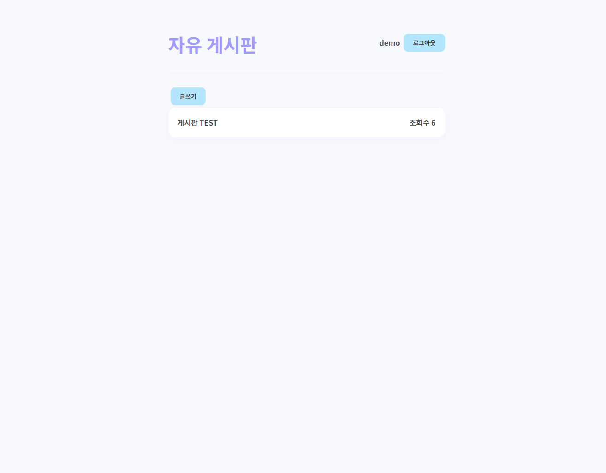
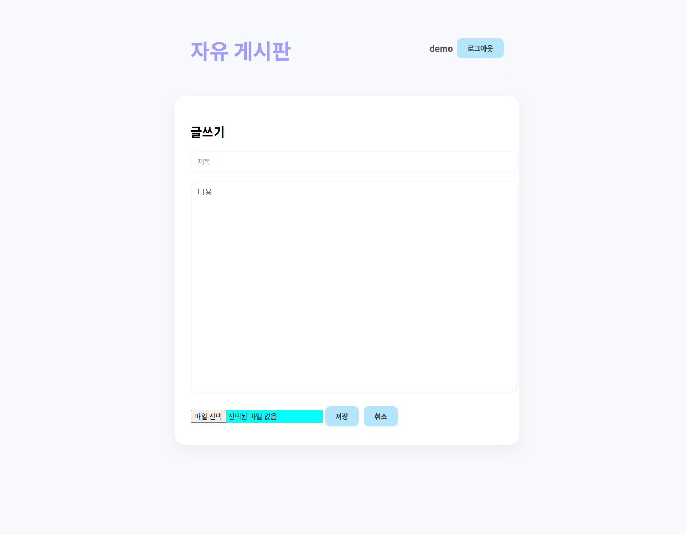
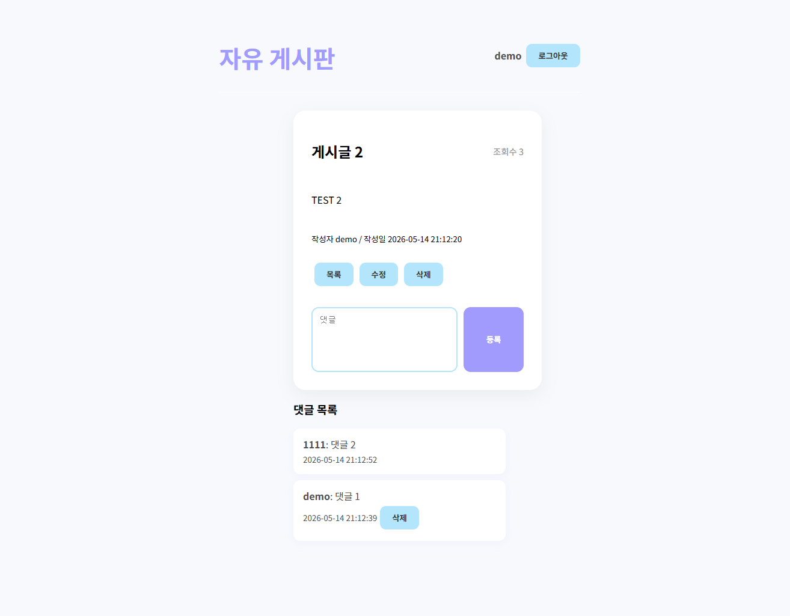

# 자유 게시판

React와 PHP로 구현한 회원 기반 자유 게시판입니다. 게시글 작성, 이미지 업로드, 댓글, 조회수, 작성자 권한 검사를 포함한 기본 게시판 흐름을 구현했습니다.

## 배포 주소

https://toma2025.dothome.co.kr/posts/

## 화면 미리보기

> 아래 이미지는 `docs/images/` 폴더에 같은 파일명으로 저장하면 GitHub README에서 바로 확인할 수 있습니다.

### 게시글 목록



로그인한 사용자의 이름과 로그아웃 버튼을 보여주며, 게시글 제목과 조회수를 목록 형태로 확인할 수 있습니다.

### 글쓰기



제목, 내용, 이미지 파일을 입력해 새 게시글을 등록할 수 있습니다.

### 게시글 상세 및 댓글



게시글 상세 내용, 작성자, 작성일, 조회수, 댓글 목록을 확인할 수 있으며 작성자 본인에게만 수정/삭제 버튼이 노출됩니다.

## 주요 기능

- 회원가입 및 로그인
- 세션 스토리지를 이용한 로그인 상태 유지
- 게시글 목록 조회
- 게시글 작성, 상세 조회, 수정, 삭제
- 이미지 다중 업로드
- 게시글 조회수 증가
- 댓글 작성 및 삭제
- 게시글 삭제 시 연결된 댓글 함께 삭제
- 작성자 본인만 게시글 수정/삭제 가능
- 작성자 본인만 댓글 삭제 가능

## 기술 스택

| 영역 | 기술 |
| --- | --- |
| Frontend | React, JavaScript, SCSS |
| Backend | PHP |
| Database | MySQL |
| Deployment | Dothome |

## 프로젝트 구조

```text
posts/
  src/
    App.js
    App.scss
  backend/
    auth.php
    db.example.php
    login.php
    signup.php
    posts.php
    write.php
    update.php
    delete.php
    comments.php
    get_comments.php
    delete_comment.php
    views.php
    uploads/
  public/
  build/
```

## 실행 방법

프론트엔드 의존성을 설치한 뒤 개발 서버를 실행합니다.

```bash
npm install
npm start
```

배포용 파일은 아래 명령어로 생성합니다.

```bash
npm run build
```

## 백엔드 설정

`backend/db.example.php`를 참고해 실제 DB 접속 정보를 담은 `backend/db.php`를 생성해야 합니다.

```php
<?php
$conn = mysqli_connect("DB_HOST", "DB_USER", "DB_PASSWORD", "DB_NAME");
?>
```

이미지 업로드를 사용하려면 서버의 `backend/uploads/` 폴더에 쓰기 권한이 필요합니다.

## API 구성

| 파일 | 역할 |
| --- | --- |
| `signup.php` | 회원가입 |
| `login.php` | 로그인 |
| `posts.php` | 게시글 목록 조회 |
| `write.php` | 게시글 작성 및 이미지 업로드 |
| `update.php` | 게시글 수정 |
| `delete.php` | 게시글 삭제 |
| `views.php` | 조회수 증가 |
| `comments.php` | 댓글 작성 |
| `get_comments.php` | 댓글 목록 조회 |
| `delete_comment.php` | 댓글 삭제 |
| `auth.php` | 인증 및 작성자 권한 확인 |

## 데이터베이스 참고

기존 테이블에 필요한 컬럼이 없을 경우 백엔드에서 아래 컬럼을 확인해 사용합니다.

```text
users.api_token
posts.user_id
comments.user_id
```

댓글과 게시글의 연결 삭제 처리는 `backend/cascade_posts_comments.sql`을 참고합니다.

## 테스트 계정

테스트는 회원가입 화면에서 직접 계정을 생성한 뒤 진행할 수 있습니다.

```text
아이디: testuser
비밀번호: test1234
```

## 구현 포인트

- 로그인 성공 시 발급받은 토큰을 요청 헤더와 요청 본문에 함께 전달해 인증을 처리했습니다.
- 게시글과 댓글에 `user_id`를 저장해 작성자 본인 여부를 판단했습니다.
- 작성자 권한이 없는 사용자는 수정/삭제 UI가 보이지 않도록 처리했습니다.
- 서버 응답이 올바른 JSON인지 확인하는 공통 요청 함수를 두어 API 오류를 쉽게 확인할 수 있게 했습니다.
- 이미지 업로드는 `FormData`를 사용해 여러 파일을 한 번에 전송하도록 구현했습니다.
